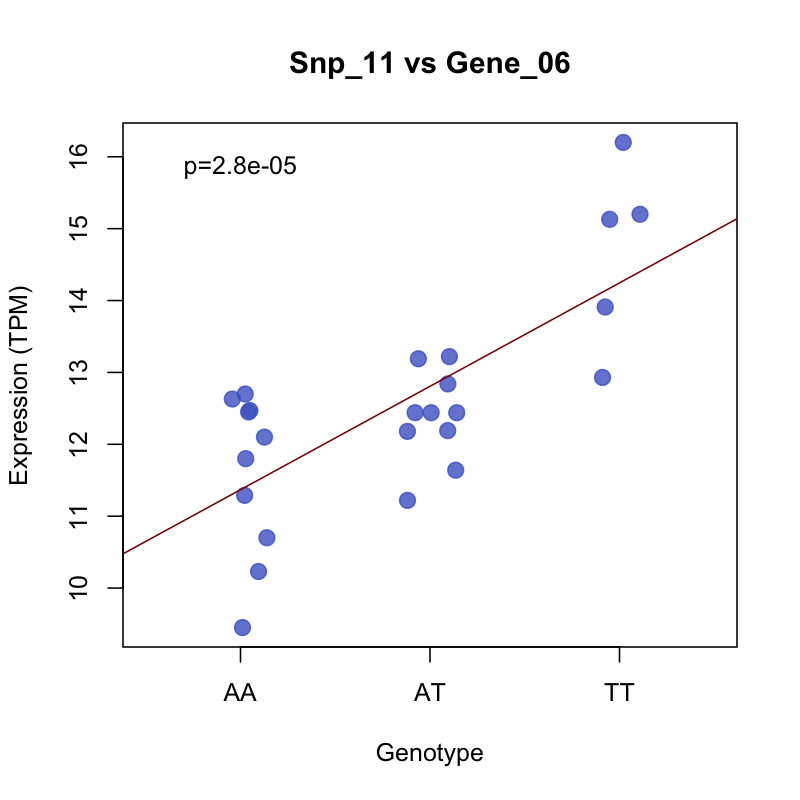

# List the genetic variants associated with diseases,  all aboard the Variant Express!

Genetic variants are abundant and can contribute to an individual's risk of disease. Past studies on variants are not practical for searching by disease on a massive scale or viewing association testing for expression of certain genes.  

The Variant Express is a new pipeline that creates association testing between variants in RNA-Seq data and expression analysis, in order to create leads for research. 

# How Does The Variant Express Do It??

Overview Diagram

# How to use The Variant Express

### Dependencies

- R >= 3.3
- Python >= 3.6.4
- zlib >= 1.2.8

##### R Packages
- optparse
- MatrixEQTL
- httr
- jsonlite
- dplyr
- rentrez

See all [dependencies](https://github.com/NCBI-Hackathons/TheVariantExpress/blob/master/DEPENDENCIES)

### Installation

1. `git clone git@github.com:NCBI-Hackathons/TheVariantExpress.git && cd TheVariantExpress`
2. `git clone git@github.com:AndersenLab/SEmRNA-seq-nf.git`
3. `wget -qO- https://get.nextflow.io | bash`

### Running

    ./nextflow run main.nf -profile local -resume --reads "<directory_path>" --email "<your_email>" --output "output" --transcriptome "<transcriptome_file_location>"

##### Parameters

- `-profile`: The server environment; can be `local` or `quest`
- `--reads`: Path to directory of FASTQ files (Single and/or pair reads)
- `--email`: Email address to send notifications and results
- `--output`: Name of output directory
- `--transcriptome`: Transcriptome used for reads mapping

# Software Workflow Diagram

Hackathon team: Cong Chen, Matthew Dapas, Joseph Subida, Octavious Talbot, Chad Travis, Ye Wang

