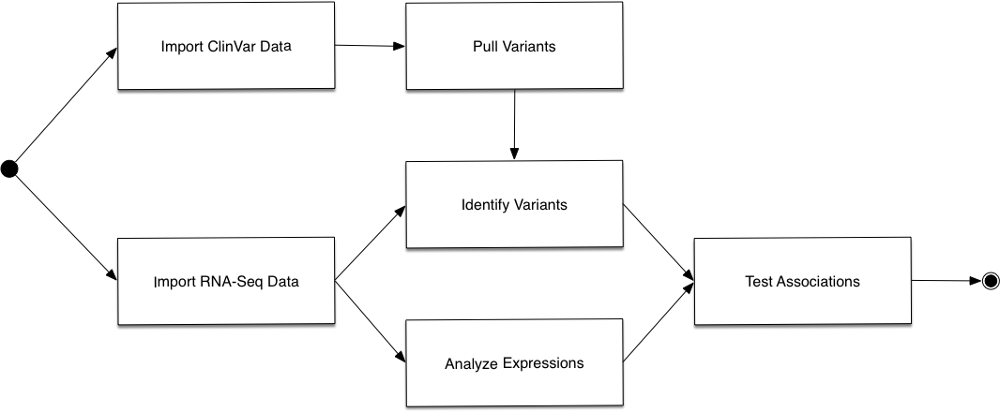

# List genetic variants associated with diseases.  All aboard the Variant Express!

Hackathon team: Cong Chen, Matthew Dapas, Joseph Subida, Octavious Talbot, Chad Travis, Ye Wang

Genetic variants are abundant and are expected to contribute to risk of disease for an individual. Previous genetic association studies have successfully identified common genetic variants associated with risk for disease, these studies are not practical for searching on a massive scale or viewing association testing for expression of certain genes.  

The Variant Express is a new pipeline that creates association testing between variants in RNA-Seq data and expression analysis, in order to create leads for research. 

# What is a Structural Variant?

A Variant is a region of DNA is over 49 nucleotides and can include inversions and balanced translocations or genomic imbalances.  These imbalances are referred to as copy number variants (CNVs), which often overlap duplications.  In addition to well-known sporadic chromosomal microdeletion syndromes and Mendelian diseases, many common complex traits including autism and schizophrenia can result from CNVs.

# How Does The Variant Express do it?

Overview Diagram



# How to use The Variant Express <this software>

Put screenshot here

# Software Workflow Diagram


# File structure diagram 
#### _Define paths, variable names, etc_

# Installation options:

We provide two options for installing <this software>: Docker or directly from Github.

### Docker

The Docker image contains <this software> as well as a webserver and FTP server in case you want to deploy the FTP server. It does also contain a web server for testing the <this software> main website (but should only be used for debug purposes).

1. `docker pull ncbihackathons/<this software>` command to pull the image from the DockerHub
2. `docker run ncbihackathons/<this software>` Run the docker image from the master shell script
3. Edit the configuration files as below

### Installing <this software> from Github

1. `git clone https://github.com/NCBI-Hackathons/<this software>.git`
2. Edit the configuration files as below
3. `sh server/<this software>.sh` to test
4. Add cron job as required (to execute <this software>.sh script)

### Configuration

```Examples here```

# Testing

Test it


